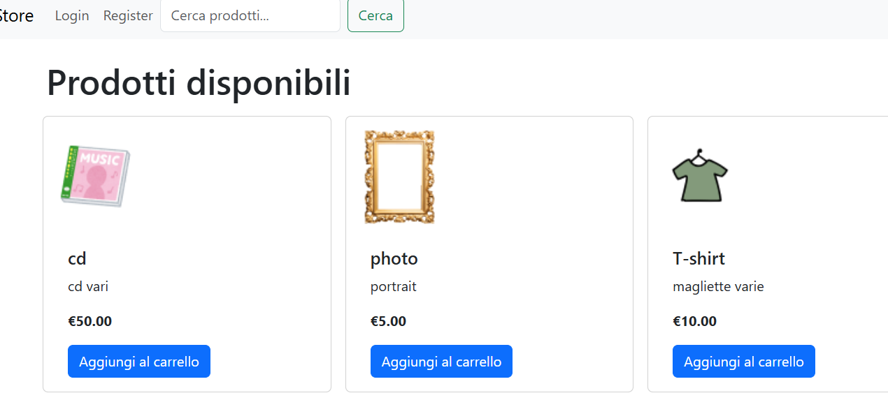
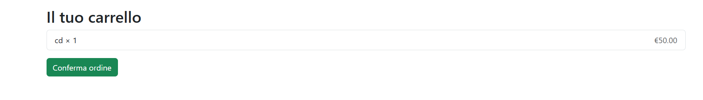
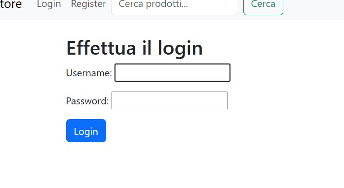

Questo progetto è un semplice sito e-commerce sviluppato con Django. Gli utenti possono registrarsi, navigare tra i prodotti, aggiungerli al carrello e confermare un ordine. Gli amministratori o store manager possono gestire i prodotti e gli ordini tramite l’interfaccia di amministrazione Django.

### 👤 Funzionalità utente

- Registrazione e login
- Visualizzazione dell’elenco prodotti con immagini, nome, prezzo e categoria
- Ricerca prodotti per nome
- Aggiunta di prodotti al carrello
- Visualizzazione del carrello con riepilogo
- Conferma dell’ordine

### 🛒 Carrello

Il carrello è associato all'utente autenticato:
- Se non sei loggato, ti verrà chiesto di accedere prima di aggiungere articoli.
- I prodotti aggiunti rimangono nel carrello fino alla conferma dell’ordine.

### 🛠️ Funzionalità per Store Manager

Gli utenti con permesso `is_store_manager=True` possono:
- Accedere al pannello di amministrazione (`/admin/`)
- Aggiungere, modificare o cancellare prodotti
- Gestire categorie e ordini effettuati dagli utenti

### 🔐 Autenticazione

- Gli utenti possono registrarsi su `/accounts/register/`
- Login su `/accounts/login/`
- Logout disponibile tramite pulsante visibile dopo il login (richiesta POST)

---

📌 Per accedere come admin/store manager all'indirizzo http://127.0.0.1:8000/admin:
user: admin con password Password1234
---
Per fare acquisti:
user: utente con password Segreto1234

## 📸 Screenshot

### Homepage

### Carrello

### Login

N.B.: il progetto è stato portato su railway con conseguenti modifiche per adattarlo alla piattaforma (database Postgres, ecc.)
il progetto è visibile all'indirizzo: https://ecommercedjango-production-ec6e.up.railway.app/
